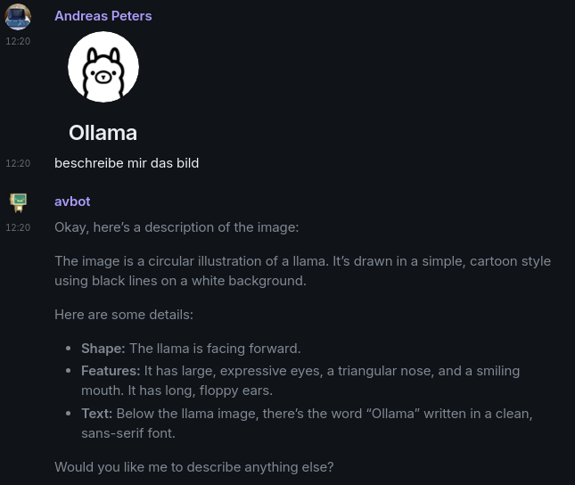
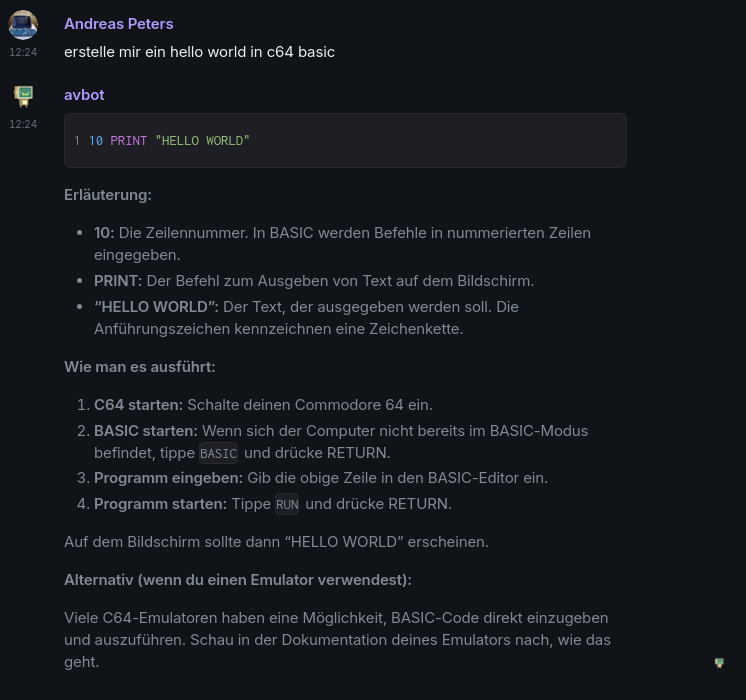
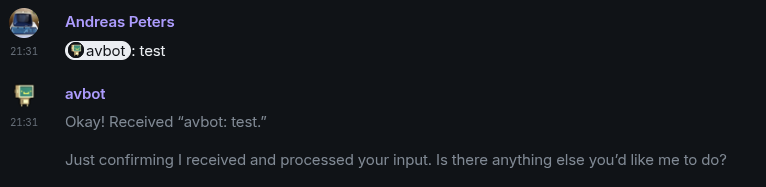
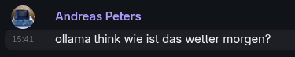

# go-avbot - the aventer bot

AVBOT is a bot for the Matrix Chat System.


## Funding

[](https://www.paypal.com/donate/?hosted_button_id=H553XE4QJ9GJ8)

## How to use it?

First we have to create a config.yaml inside of data directory that we have to
mount into the container. A sample of these config can be found in our Github
repository.

```bash
docker run -v ./data:/app/data:rw avhost/go-avbot:latest
```

## License

go-neb is under the Apache License. To make it more complicated, our code are
under GPL. These are:

- aws (services/aws)
- invoice (services/invoice)
- pentest (services/pentest)

## Features

### AWS

- Start/Stop of AWS instances
- Show list of all instances in all regions
- Create Instances
- Search AMI's

### Pentest

- Penetrate a server target
- Create a report about the penetrations test result and upload it into the chat
room

There are still a lot of work. Currently our main focus is the AWS support.

### Wekan

- Receive Webhooks from your wekan boards

### Gitea

- Receive Webhooks from your gitea repo

### Unifi Protect

- Receive events from Unifi Protect devices
- Support Unifi Protect Alarm Manager via Webhook

### Ollama AI

- Chat with ollama! It even support picture upload




If there is only one user besides the bot in a room, then Ollama reacts to every
message.
If there is more than one user besides the bot in a room, you have to explicitly
address the message to the bot.



- `ollama think` before your message will tell ollama to think about the
response.



### Buymeacoffee

- Receive membership-subscription and cancellation webhooks from Buy Me a
Coffee.
- Automatically remove a user from the membership room after their membership
has been cancelled.
- Important: New users will not be added automatically, since there is no
reliable way to match a Matrix user with a BMC user. The workflow is as follows:


1) The user subscribes to a membership.
2) In the BMC bot room, you will receive a notification about the new subscription,
including the BMC name and email.
3) The user must send you an email containing their Matrix ID.
4) In the BMC bot room, you then run the following command:

```bash
!supporter add <email> <matrix-id> <bmc_name>
```

The email must match the one registered in BMC.

5) Once this is done, the user will automatically be added to the BMC community room.

If the user cancels their subscription, they will automatically be removed from the
community room. In case this does not work, there is a manual command:

```bash
!supporter delete <email>
```

## API Documentation

- [Matrix API](https://www.matrix.org/docs/spec/r0.0.0/client_server.html)
- [AWS
API](https://docs.aws.amazon.com/sdk-for-go/v1/developer-guide/setting-up.html)
- [OpenVAS](https://docs.greenbone.net/API/GMP/gmp-20.08.html)

